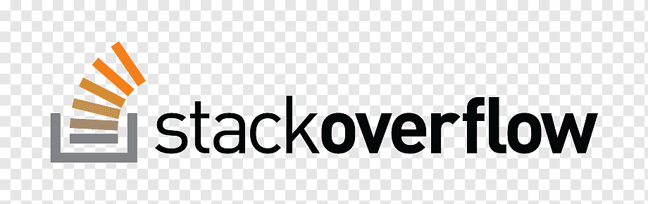

# **Leland Bove's User Page**

## Sections 
- [ ] [Programming Languages](#programming-languages-i-have-used)
- [ ] [Programming Quote](#favorite-programming-quote)
- [ ] [First Program](#first-program-i-wrote-hello-world)
- [ ] [Favorite Sites to Learn How to Program](#favorite-places-to-learn-programming-outside-of-class)

#### Programming Languages I Have Used
- Java
- Python
- C
- C++
- **Swift**

#### Favorite Programming Quote
> Any fool can write code that a computer can understand. Good programmers write code that humans can understand. - Martin Fowler

#### First Program I Wrote: Hello, World!
```
print("Hello, World!")
```

#### Favorite Places to Learn Programming Outside of Class
1. [YouTube Link](https://www.youtube.com)
   
2. [Stack Overflow Link](https://stackoverflow.com)  


#### Relative Link to My README Page
[Click here for README](README.md)
  


